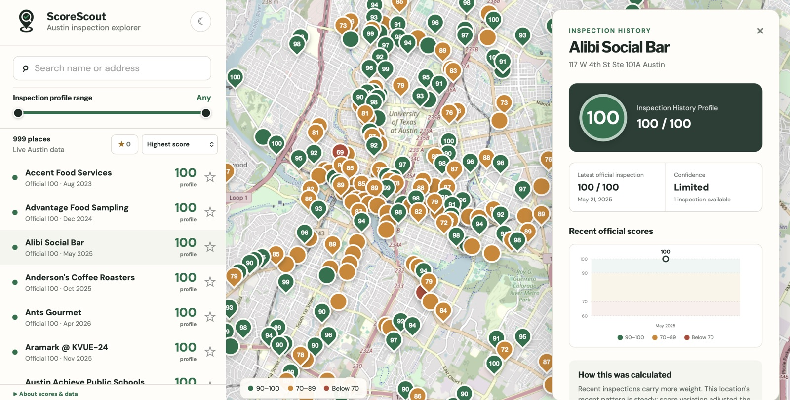

# ScoreScout 1.0

A map-first explorer for Austin restaurant health inspections. ScoreScout shows the latest official Austin Public Health inspection score for a restaurant alongside a derived, explainable **Inspection History Profile** — a weighted view of recent inspection history, not a food-safety verdict.

Live at [scorescout.org](https://www.scorescout.org).



## Why

Routine inspections are point-in-time snapshots. ScoreScout summarizes available inspection history so a diner can see the trend at a glance, without implying that the app independently judges whether a restaurant is safe or clean.

## Features

- Map with score-aware clustering — nearby restaurants group into bubbles colored by the worst score in the group, splitting into individual pins as you zoom in
- Search by name or address, filter by inspection profile range and place type, sort by score/date/name
- Shareable per-restaurant links
- Reviewed duplicate permits consolidate under one canonical establishment while preserving their official source histories and legacy links
- Save/favorite restaurants, persisted locally and pinned above the scrolling results
- Light/dark theme, following system preference by default
- Mobile-first Map/List views with a compact branded header and persistent search
- Browser geolocation control for quickly returning the map to your position

## Data source

[City of Austin Food Establishment Inspection Scores](https://data.austintexas.gov/Health-and-Community-Services/Food-Establishment-Inspection-Scores/ecmv-9xxi), keyed by `facility_id`.

The frontend uses `/api/restaurants` when the Supabase environment is configured and falls back to local fixture data during setup.

## Live data setup

1. Create a Supabase project and run the migrations in `supabase/migrations/` (in order) in its SQL editor.
2. Add `SUPABASE_URL` and `SUPABASE_SECRET_KEY` in Netlify environment variables. Use a modern `sb_secret_…` key and never expose it in browser code or source control.
3. Deploy, then run the `import-austin` scheduled function once from Netlify's Functions page.
4. Add a random `IMPORT_SECRET` in Netlify, then invoke the protected `/api/geocode-census?limit=100` background function with `Authorization: Bearer <IMPORT_SECRET>`, paging through with `&after=<lastRouteNumber>` until the backlog is geocoded. This is free and requires no API key.
5. Optionally add `GOOGLE_PLACES_API_KEY` and invoke `/api/enrich-google-places?limit=50` the same way, to attach community ratings. This is independent of map/list coverage — it only adds ratings, not coordinates.

The Google enrichment function only accepts matches at or above the configured confidence threshold; uncertain matches are skipped for manual review.

## Tech stack

- React + Vite + TypeScript
- React Router for shareable restaurant deep links
- Leaflet / React-Leaflet + Supercluster for the map
- Supabase (Postgres + PostGIS) for data, Netlify Functions for the API and import/enrichment jobs
- Vitest for unit tests (scoring logic, URL-matching logic)

## Getting started

```bash
npm install
npm run dev
```

Other scripts:

```bash
npm run build   # type-check and build for production
npm run lint    # eslint
npm run test    # vitest
```

## Project structure

```text
src/
  api/              data access
  components/       MapView, RestaurantDetail, RestaurantList, ScoreBadge
  features/restaurants/  scoring logic and types
  pages/            ExplorePage
  styles/           design tokens / global CSS
scripts/            data import / profile calculation jobs
```

See [austin-score-scout-implementation.md](austin-score-scout-implementation.md) for the full implementation handoff, including the scoring contract, database model, and build sequence.

Agents and maintainers should read [docs/current-state.md](docs/current-state.md) first for the current deployed functionality, infrastructure state, active work, known issues, and operational guardrails.

## Deployment

Netlify deployment is configured in `netlify.toml`:

- Build command: `npm run build`
- Publish directory: `dist`
- Functions directory: `netlify/functions`
- SPA rewrite to `index.html` so restaurant deep links resolve on refresh

## Release status

Version 1.0.0 is live with real Austin inspection data. The next local release adds a conservative default filter for identified schools and healthcare institutions; ambiguous types such as grocery and convenience stores intentionally remain visible pending audited rules. The public API still caps the unscoped map/browse view at 1,000 rows (search is unaffected). See [CHANGELOG.md](CHANGELOG.md) for release notes and [docs/current-state.md](docs/current-state.md) for the full operational handoff.
